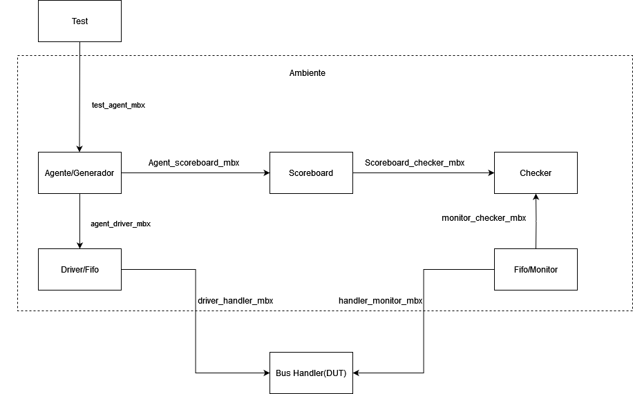

# Proyecto 1 Verificación: Alex Aguero-Jose Chaves

En este repositorio se encontrarán todas las bibliotecas para hacer la verificación funcional de un bus de datos como se puede ver en la siguiente imagen:

Esto mediante un ambiente de verificación conformado de lo siguiente:

1. DUT: Como se puede observar en [Library.sv](Libraries/Library.sv)
2. Ambiente: Compuesto por varios elementos, estos siendo:

        -Test 
        
        -Agente 
        
        -Driver 
        
        -Monitor 
        
        -Scoreboard 
        
        -Checker
   **#Como correr el proyecto**
   
   usar el comando disponible en [Library.sv](Libraries/VCS_Run.sh)
